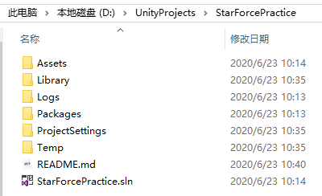

## StarForcePractice 简介

StarForcePractice是一个对**[StarForce](https://github.com/EllanJiang/StarForce)**的Copy练习项目，主要目的是学会Game Framework框架的使用，下面是一些个人的学习记录。

---

## 准备工作

### 项目搭建

+ 本地创建一个名为`StarForcePractice`项目并添加README.md文件作为学习笔记。

+ `Github`创建一个同名仓库，不勾选`README`初始化，因为我们上面已经创建了

+ 使用`git init`命令将本地项目初始化为Git版本库

+ 将本地仓库与远程仓库关联
  
+ 将本地仓库所有内容推送到远程