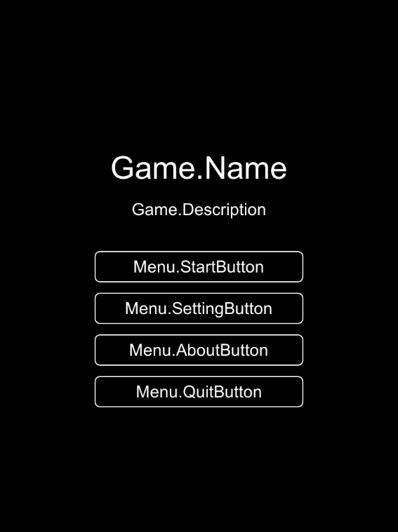
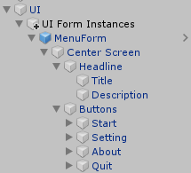
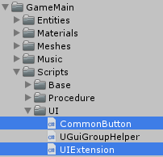
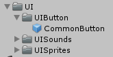
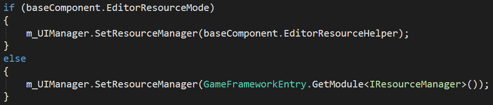
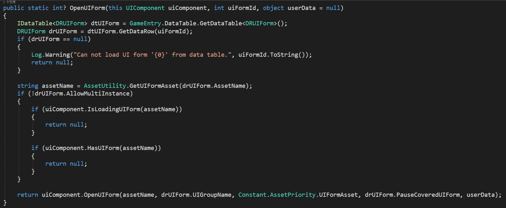
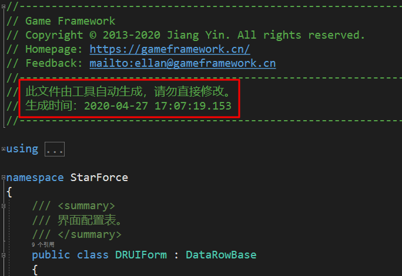
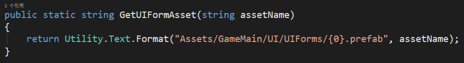
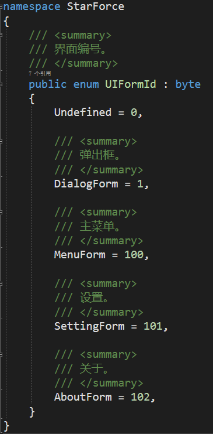
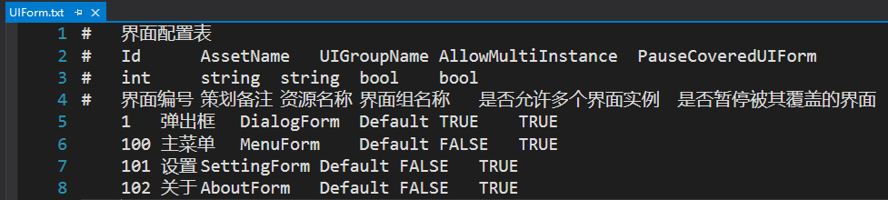

## StarForcePractice 简介

StarForcePractice是一个对[StarForce](https://github.com/EllanJiang/StarForce)的Copy练习项目，主要目的是学会Game Framework框架的使用，下面是一些个人的学习记录。

---

## 准备工作

### 项目搭建

+ 本地创建一个名为`StarForcePractice`项目并添加README.md文件作为学习笔记。


+ `Github`创建一个同名仓库，不勾选`README`初始化，因为我们上面已经创建了


+ 使用`git init`命令将本地项目初始化为Git版本库


+ 将本地仓库与远程仓库关联


+ 使用`git add .`和 `git commit -m"首次提交"`命令进行首次提交。
+ 使用`git push -u origin master`将本地仓库所有内容推送到远程仓库。

---

### 项目资源与框架导入

+ 创建`GameFramework`文件夹并将框架导入到该文件夹中。
  
+ 创建`GameMain`文件夹，打开`StarForce`项目将项目中用到资源都拉到我们的项目中来。


OK，到此项目所有准备工作就完成了，就下来就开始开发了~

---

## 开发

### 场景搭建

#### :small_blue_diamond:初识内置模块

+ 在场景中创建空物体`Game Framework`，将框架中的`GameFramework`预制体拖放到该空物体下。


1.我们可以看到该预制体下面有很多子物体，这些就是GF框架为我们提供的内置模块。

2.每个子物体上都挂载了以`Component`结尾的脚本，它们的底层自然就是继承了`MonoBehaviour`。

> GF对很多游戏开发常用模块进行了封装，很大程度地规范开发过程、加快开发速度并保证产品质量。

+ 既然有内置组件，那么框架肯定也为我们提供了创建自定义组件的接口，只需要继承自框架的`GameFrameworkComponent`类。
+ 在`Game Framework`父节点下创建一个空物体`Customs`用于存放我们的自定义组件，然后将预制体名字修改为`Built-in`意思是内置的组件。


#### :small_blue_diamond:框架组件的获取与初始化

+ 在`Game Framework`中，获取一个内置组件的代码是这样的：

```c#
// 获取 UI 组件
UIComponent uiComponent = UnityGameFramework.Runtime.GameEntry.GetComponent<UIComponent>();
// 获取 Base 组件
BaseComponent baseComponent = UnityGameFramework.Runtime.GameEntry.GetComponent<BaseComponent>();
```

+ 设计我们项目的`GameEntry`，将使用到的内置组件和自定义组件封装成全局的只读静态属性，并初始化用到的组件。

```c#
// 基础组件
public static BaseComponent Base
{
    get;
    private set;
}
```

+ 使用`partial`关键字，将`GameEntry`入口类分成三个文件实现，并将`GameEntry.cs`挂到`Game Framework`根节点上。


```c#
// GameEntry.cs 主体类
namespace StarForce
{
	public partial class GameEntry : MonoBehaviour
    {
        private void Start()
        {
            InitBuiltinComponents();
            InitCustomComponents();
        }
    }
}
// GameEntry.Builtin.cs 存放内置组件的分部类
namespace StarForce
{
	public partial class GameEntry : MonoBehaviour
    {
        // 基础组件
        public static BaseComponent Base
        {
            get;
            private set;
        }
        public static void InitBuiltinComponents()
        {
            Base = UnityGameFramework.Runtime.GameEntry.GetComponent<BaseComponent>();
        }
    }
}
// GameEntry.Custom.cs 存放自定义组件的分部类
namespace StarForce
{
	public partial class GameEntry : MonoBehaviour
    {
       public static void InitCustomComponents()
        {
        }
    }
}
```

#### 场景灯光与照明设置

+ 删除掉场景中自带的`Directional Light`平行光。
+ `Window>Rendering>Lighting Settings` 打开照明设置窗口，关闭掉天空盒与环境照明。


#### 场景相机设置

+ 命名为`Camera`，重置`Transform`，清除`Tag`设置，设置背景色为纯黑色。
+ 设置相机的渲染内容`Culling Mask`为`Nothing`，缩小相机的可视范围`Clipping Planes`，取消勾选`HDR`。

### HelloWord实现

#### :small_blue_diamond:初识流程模块 - Procedure Component

> **流程贯穿游戏运行时整个生命周期的有限状态机。**通过流程，将不同的游戏状态进行解耦将是一个非常好的习惯。对于网络游戏，你可能需要如检查资源流程、更新资源流程、检查服务器列表流程、选择服务器流程、登录服务器流程、创建角色流程等流程，而对于单机游戏，你可能需要在游戏选择菜单流程和游戏实际玩法流程之间做切换。如果想增加流程，**只要派生自 ProcedureBase 类并实现自己的流程类即可使用。**

+ 我们需要知道的点是：**流程是对有限状态机的再封装，许多流程相关的用法和有限状态机是类似的。**
+ 创建测试用的流程`ProcedureTest`


```c#
using GameFramework.Procedure;
using ProcedureOwner = GameFramework.Fsm.IFsm<GameFramework.Procedure.IProcedureManager>;
namespace StarForcePractice
{
    public class ProcedureTest : ProcedureBase
    {
        protected override void OnEnter(ProcedureOwner procedureOwner)
        {
            base.OnEnter(procedureOwner);
            Debug.Log("Hello World!");
        }
    }
}
```

+ 在流程组件上配置我们的流程，勾选启用我们的流程，并将其设置为入口流程`Entrance Procedure`


#### :small_blue_diamond:日志工具集

+ 框架内部也为我们提供了打印日志的工具，不同的是，我们可以一键开启或关闭日志的打印，这样就不用担心忘记注释，发布后日志输出带来性能损耗。

```c#
// 打印调试级别日志，用于记录调试类日志信息
Log.Debug("Hello World!");

// 打印信息级别日志，用于记录程序正常运行日志信息
Log.Info("Hello World!");

// 打印警告级别日志，建议在发生局部功能逻辑错误，但尚不会导致游戏崩溃或异常时使用
Log.Warning("Hello World!");

// 打印错误级别日志，建议在发生功能逻辑错误，但尚不会导致游戏崩溃或异常时使用
Log.Error("Hello World!");

// 打印严重错误级别日志，建议在发生严重错误，可能导致游戏崩溃或异常时使用，此时应尝试重启进程或重建游戏框架
Log.Fatal("Hello World!");
```


> 打印日志的开销非常大（尤其是内存方面），所以在正式发布游戏时，尽量选取 Disable All Logs（关闭所有日志）或者 Enable Error And Above Logs（仅开启错误及以上级别日志）。

### UI模块

#### :small_blue_diamond:初识UI模块 - UI Component

+ 首先，我们查看框架提供的UI组件，看Inspector上有哪些属性，它们是设置什么的？


+ **经过对源码的一番阅读，了解到以下信息：**

  1.红框：是否启用这些UI相关事件，不启用内部就不会注册该事件，我们应该用到的时候才启用。

  2.绿框：UI对象池管理器的相关参数配置，这个知道是什么就好**先留坑**。
  3.Instance Root：所有界面实例的根节点，代码中是每创建一个`UIGroup`界面组，就会将其设置到根节点下。

  > 示例项目中，作者在`UI`下创建了一个名为“`UI Form Instances`”的`Canvas`作为根节点，我们依样画葫芦就好了~

  4.UI Form Helper：界面辅助器，我们需要自己实现一个继承自`UIFormHelperBase`的界面辅助器，然后在`Inspector`就可以选择我们实现的界面辅助器了。

  > `UIFormHelperBase`实现了底层提供的`IUIFormHelper`接口，此界面辅助器接口用于实例化、创建、释放界面。
  > **为什么要有界面辅助器这个东西？**
  > 由于`GameFramework.dll`不是基于Unity开发的，因此实例化、创建、释放界面这些操作作者就需要写成接口的形式。使用者根据不同的使用场景就需要通过对应场景的API去实现这些功能。
  > 举个例子：我们在Unity中使用，那么我们就需要使用Unity的API去实现实例化、创建、释放界面的功能。而底层逻辑就只管调用这个接口的方法即可，它并不关心你是使用Unity API实现还是其它场景的API实现，<u>这就是面向接口编程的好处</u>。
  > 当然，在`UnityGameFramework`中作者已经为我们实现了一个默认的界面辅助器`DefaultUIFormHelper`，我们可以直接在Inspector中选择它，如果你有特殊需求，也可以自己实现一个界面辅助器。
  > **GameFramework相关源码查看指南**
  >
  > `UIManager.cs`中的`LoadAssetSuccessCallback`方法 ...993、996行，`InternalOpenUIForm`方法 ...944行。
  
  5.UI Group Helper：界面组辅助器，同上，继承`UIGroupHelperBase`实现自己的界面组辅助器，然后在Inspector上指定。

  > 作者对于`UI`模块的设计是支持`NGUI`和`UGUI`的，这两个UI方案设置深度的`API`不一样，因此界面组辅助器就诞生了。
>
  > 需要注意的是，在`UnityGameFramework`中提供的`DefaultUIGroupHelper`默认界面组辅助器并没有任何实现。我盲猜作者可能考虑到用户使用的UI方案不同，所以默认界面组辅助器就留空了。（ps：请叫我心理分析大师:laughing:）
  > 在`StarForce`示例中，作者实现了`UGuiGroupHelper`UGUI界面辅助器，使用`UGUI`可以参考此界面组辅助器。

  6.UI Groups：界面组设置，我们根据需要在`Inspector`中设置界面组，需要设置名字和深度值，内部会根据设置在根节点下生成所有界面组。

+ OK，接下来运行下示例，我们再好好体会一下


通过上图所示结构，再结合我们前面知道的信息，我们可以得出以下结论：

> 1.首先`UIComponent`是UI模块的核心，它在内部有一个`m_UIManager`字段，底层实际上就是一个`UIManager`，负责管理我们的UI。
>
> 2.UI组织方式：`UI Root`根节点存放管理所有`UI Group`界面组，界面组用来分组存放管理所有界面`UIForm`
>
> 3.界面组辅助器用于指定界面组设置深度的方法，界面辅助器则用于指定界面实例化、创建、释放界面的方法。

#### 配置UI组件

+ `UI`下创建一个`Canvas`，设置分辨率为768x1024，并将它赋值给`Instance Root`作为UI实例根节点。
+ 添加一个界面组，名字为`Default`，深度设置为0
+ 创建目录`GameMain/Scripts/UI`，把`UGuiGroupHelper`拷贝过来放到该目录下，然后就可以在面板上设置界面组辅助器了。


> **深度值是干什么用的?界面组辅助器为什么这么写?我们先不管。等后面用的过程中遇到阻碍我们使用的问题时再去深究，这是学习使用一个框架比较高效的方法。不要着急，循序渐进。**

#### :small_blue_diamond:UIFormLogic与UIForm

通过上面的探索，我们了解了UI组件的基本信息，包括设置UI根节点、界面组，UI界面辅助器和UI界面组辅助器的作用，那么怎么创建自己的界面呢？这是我们接下来需要解决的问题。

+ 我们先来看一下作者对于UI模块的描述：

> UI模块：提供管理界面和界面组的功能，如显示隐藏界面、激活界面、改变界面层级等。不论是 Unity 内置的 uGUI 还是其它类型的 UI 插件（如 NGUI），**只要派生自 UIFormLogic 类并实现自己的界面类即可使用**。界面使用结束后可以不立刻销毁，从而等待下一次重新使用。

+ OK，通过描述我们知道了要实现自己的界面只需要继承自`UIFormLogic `类并实现界面逻辑即可，框架底层会帮我们管理这些界面。
+ 运行示例看看，主菜单界面的`MenuForm`组件就是实现了`UIFormLogic `类。


+ 大家是不是也和我一样发现了还有一个`UIForm`脚本，这就纳闷了，有`MenuForm`为什么还要一个`UIForm`呢？
+ 查看源码，发现在`DefaultUIFormHelper`默认界面辅助器中的`CreateUIForm`创建界面方法帮我们给界面添加上了`UIForm`组件。
+ 我们对比一下`UIForm`和`UIFormLogic `，可以发现，`UIForm`持有了`UIFormLogic `的引用，并调用了同名方法。


+ 啊哈，这就更加纳闷了，我们的`MenuForm`直接继承`UIForm`不香吗？为什么作者还要再写一个`UIFormLogic `把`UIForm`中的方法搬到里面去，而且最难受的是它俩还要互相持有引用。好吧，只看了一丢丢代码，暂时还不清楚作者这么设计的原因，**先挖个坑**。
+ 对了，忘了说示例里作者还写了`UGuiForm`对`UIFormLogic`进行了拓展，大部分逻辑都是为该示例需求服务的，我们按照自己项目需求进行拓展即可。

#### 制作MenuForm界面预制体

+ 在示例项目中，把`MenuForm`预制体拖放到`UI`根节点下，然后照着制作即可。

+ `MenuForm`界面效果以及层次结构如下图所示：





> 不知道你们有没有注意到，有个细节就是作者创建空物体会把`Rect`的尺寸都设置为0，这应该也是一个小优化吧（我瞎猜的 = = ），跟着大佬做就是了。

+ :o:我们在创建`Text`组件的时候，由于它只是用来展示信息，不需要与用户交互，所以应该把`RaycastTarget`取消勾选以优化性能，这是作者忽略掉的小细节。另外`Rich Text`用不到也应该取消勾选，这样底层就不会去检测富文本了。

+ 按钮这里作者没有使用`UGUI`的`Button`组件，可能是用不到这个组件的大部分功能吧，所以就自己写了一个轻便的版本`CommonButton`组件，我们可以直接拿来使用。
+ 把`CommonButton`和`UIExtension`脚本都拷贝过来，`UIExtension`中只留我们用到的方法`FadeToAlpha`，其它的都暂时注释掉。



> UIExtension：是对一些用到UI组件提供扩展方法，方便在操作`UI`组件的时候使用。

+ `CommonButton`脚本我们需要修改一下，把事件封装成属性，方便外部绑定监听，作者可能为了方便在面板上直接绑定方法，这里我们还是要规范一下。

```c#
[SerializeField]
private UnityEvent m_OnHover = null;
public UnityEvent OnHover
{
    get
    {
        if (m_OnHover == null)
            m_OnHover = new UnityEvent();
        return m_OnHover;
    }
}
[SerializeField]
private UnityEvent m_OnClick = null;
public UnityEvent OnClick
{
    get
    {
        if (m_OnClick == null)
            m_OnClick = new UnityEvent();
        return m_OnClick;
    }
}
```

+ 按钮制作好后我们，将它制作成预制体以复用，后续也方便批量修改。



#### :small_blue_diamond:窗体的加载与显示

**接下来，我们又有新问题了，怎么加载和显示我们的`UI`界面呢？**

+ 结合之前学到的流程，我们了解到需要创建一个菜单流程`ProcedureMenu`，然后在流程中加载并显示我们的默认窗体。

+ 打开一个窗体我们使用`IUIManager`中`OpenUIForm`方法，这个方法的底层逻辑是比较复杂的，需要好好捋捋。

  > 当我们调用这个方法的时候执行了以下操作：
  >
  > 1.首先尝试从对象池中取出该窗体，取得到就调用``InternalOpenUIForm``方法打开。
  >
  > 取不到就加载一个，加载方法传进去了`m_LoadAssetCallbacks`资源加载回调，加载完成后调用``InternalOpenUIForm``打开该窗体。
  > 【源码指南】
  >
  > `UIManager.cs`中的`OpenUIForm`方法 ...752行~761行
  >
  > 2.在`InternalOpenUIForm`方法中不只是执行了打开窗体操作这么简单...
  >
  > + 首先会使用`UI`窗体辅助器创建加载好的窗体，然后调用该窗体所在窗体组的刷新方法`Refresh`。
  >
  > + `Refresh`方法中，会根据`UI`窗体的深度以及其它相关信息来控制该`UI`窗体界面的状态。（粗略看了一下，大概是这么个意思），这就是为什么我们打开一个窗体，之前的窗体会自动隐藏，关闭一个窗体，之前的窗体会自动显示，内部已经帮我们自动管理了。
  >
  >   **OK，现在我们终于知道深度值是干啥的，它用来控制`UI`窗体组和`UI`窗体的顺序（显示隐藏等），前面挖的坑填了一个~**
  >
  > 【源码指南】
  >
  > `UIManager.cs`中的`InternalOpenUIForm`方法 ...944行、953行。
  >
  > `UIManager.UIGroup.cs`中`Refresh`方法 ...393行。

#### :small_blue_diamond:初识资源管理模块 - Resource Component

经过上面的一番瞎折腾:sweat_smile:...我们知道了`OpenUIForm`用来加载和打开一个窗体，那么是怎么加载的呢，我们又该怎么配置窗体预制体的路径？
资源加载嘛，那肯定就和`Resource `相关，顺藤摸瓜我在`UIComponent`中找到了如下代码：


哦豁，这很明显就是一个新模块，`UI模块`加载窗体使用了`资源管理模块`，直接上官方说明：

> 为了保证玩家的体验，我们不推荐再使用同步的方式加载资源，由于 Game Framework 自身使用了一套完整的异步加载资源体系，因此只提供了异步加载资源的接口。不论简单的数据表、本地化字典，还是复杂的实体、场景、界面，我们都将使用异步加载。同时，Game Framework 提供了默认的内存管理策略（当然，你也可以定义自己的内存管理策略）。多数情况下，在使用 GameObject 的过程中，你甚至可以不需要自行进行 Instantiate 或者是 Destroy 操作。

老规矩，首先，我们查看框架提供的Resource 组件，看Inspector上有哪些属性，它们是设置什么的？


+ `Inspector`面板参数详解：

  ResourceMode：资源模式，默认`Package`是单机模式，其它两种应该是和热更新有关的模式。

  Read Write Path Type：读写区路径类型，设置是临时缓存还是持久化数据。

  UnloadUnusedAssetsInterval：无用资源释放间隔时间

  绿框：资源对象池相关设置

  Instance Root：根节点

  Resource Helper：资源辅助器

  Load ResourceAgent Helper：加载资源代理辅助器

  Load ResourceAgent Helper Count：加载资源代理辅助器个数

:small_blue_diamond:初识数据表模块 - DataTable Component

既然`OpenUIForm`可以加载窗体，那么它传入的参数中一定有预制体的路径，继续顺藤摸瓜，在`UIExtension`找到作者对`OpenUIForm`方法的扩展：



哦豁，又引入了一个新模块 - 数据表模块

> 可以将游戏数据以表格（如 Microsoft Excel）的形式进行配置后，使用此模块使用这些数据表。数据表的格式是可以自定义的。

+ 首先我们看一下`DRUIForm`是个什么东西，从上面代码来看的话，就是将窗体配置`Excel`中的数据表解析后的结果复制给`DRUIForm`这个数据结构。
+ 让我有点惊讶的是，这个脚本是自动生成的，厉害了~



+ 接着我们看一下`AssetUtility`，路径终于找到了，就是根据数据表中对应的数据的窗体名返回预制体所在路径。



+ `OpenUIForm`传入的`UIFormId`就是窗体的唯一标识了



**整体的逻辑就是：传入界面编号 > 在数据表中找到对应的行 >  获取找到的数据中窗体的名称 > 找到该窗体预制体的路径 > 将路径传递给资源加载器，加载界面 >  加载完成后回调触发，界面显示**

+ 数据表位于`GameMain/DataTables/UIForm`，可以看到里面的`id`与上面枚举设置是一样的，之所以写成枚举是为了方便使用。



+ 自动生成的脚本位于`GameMain/Scripts/Editor/DataTableGenerator`中，逻辑比较繁琐，有兴趣的可以研究一下，这里我就不再赘述了。

#### 加载MenuForm窗体并显示